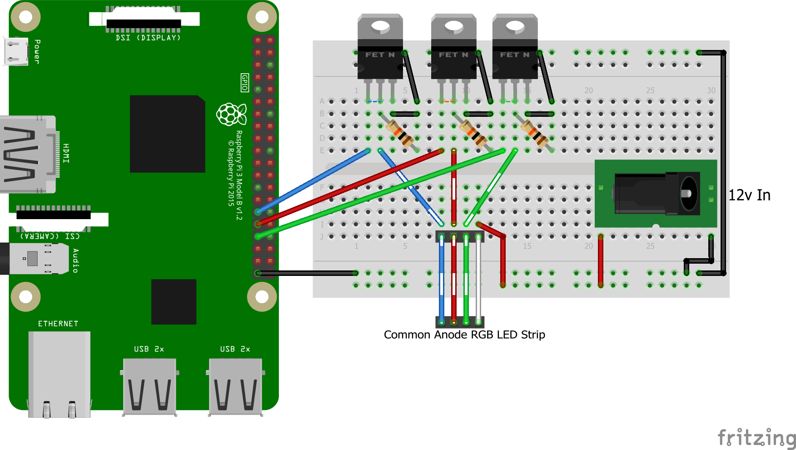

# Raspberry pi MQTT light using JSON for Home Assistant
Led control using JSON and MQTT designed for [Home Assistant](https://home-assistant.io/). This module was based on the [ESP8266 module](https://github.com/corbanmailloux/esp-mqtt-rgb-led) but written from scratch to be used on a Raspberry pi.

## Installation/Configuration

To set this system up, you need to configure the [MQTT JSON light](https://home-assistant.io/components/light.mqtt_json/) component in Home Assistant and set up a light to control. This guide assumes that you already have Home Assistant set up and running. If not, see the installation guides [here](https://home-assistant.io/getting-started/).

### The Home Assistant Side
1. In your `configuration.yaml`, add the following, depending on the supported features of the light:

    ```yaml
 # Only one color:
light:
  - platform: mqtt
    schema: json
    name: mqtt_json_light_1
    state_topic: "home/json_brightness"
    command_topic: "home/json_brightness/set"
    brightness: true
    effect: true
    effect_list: [flash]
    optimistic: false
    qos: 0

# RGB:
light:
  - platform: mqtt
    schema: json
    name: mqtt_json_light_2
    state_topic: "home/rgb1"
    command_topic: "home/rgb1/set"
    brightness: true
    rgb: true
    effect: true
    effect_list: [colorfade_slow, colorfade_fast, flash]
    optimistic: false
    qos: 0

# RGBW:
light:
  - platform: mqtt
    schema: json
    name: mqtt_json_light_3
    state_topic: "home/rgbw1"
    command_topic: "home/rgbw1/set"
    brightness: true
    rgb: true
    white_value: true
    effect: true
    effect_list: [colorfade_slow, colorfade_fast, flash]
    optimistic: false
    qos: 0
    ```
2. Set the `name`, `state_topic`, and `command_topic` to values that make sense for you.
3. Restart Home Assistant. Depending on how you installed it, the process differs. For a Raspberry Pi All-in-One install, use `sudo systemctl restart home-assistant.service` (or just restart the Pi).

### The Light Side
This module depends on the [pigpio](https://www.npmjs.com/package/pigpio) library. Before installing this module, you should install the [pigpio C library](https://github.com/joan2937/pigpio). More detailed instructions can be found [here](https://www.npmjs.com/package/pigpio#step-1---install-the-pigpio-c-library).

#### Steps
1. Install [pigpio C library](https://github.com/joan2937/pigpio).
2. Install module dependencies: `npm i`.
3. Update the config: edit the `config/default.js` file or create local config according to [node-config](https://github.com/lorenwest/node-config/wiki/Configuration-Files).
4. Run the module directly using `npm start` or use a process manager like [pm2](https://github.com/Unitech/pm2).

#### Wiring
For an RGB LED strip using N-MOSFETs for control, you'll want to wire it similar to this:
**The resistors should be connected to the gate of the mosfet and not the drain which is displayed in the image**


## Differences from ESP8266 module
* Missing flash effect
* Colorfade can receive transition time
